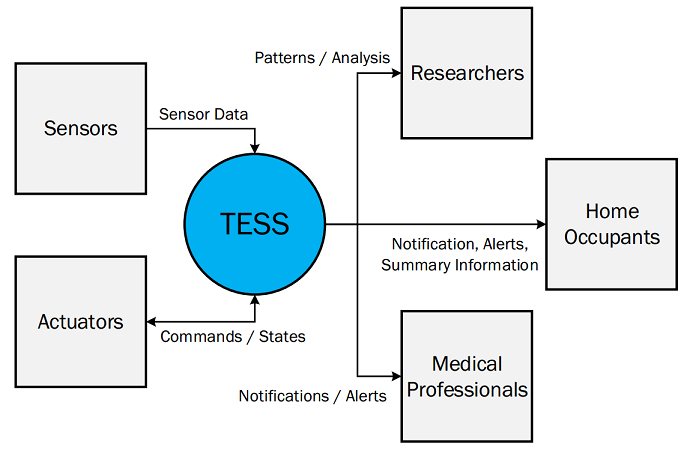
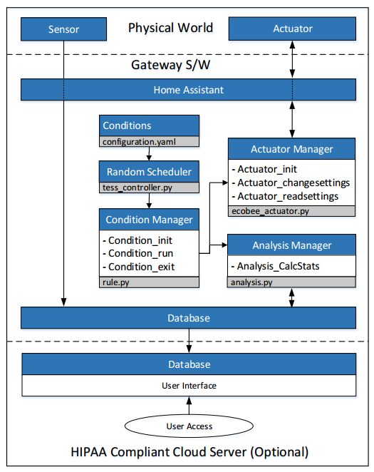

# TESS
TESS is a general software framework that enables a repeated measurement RCT for IoT-based smart health applications.

## :: Context
TESS connects various sensors and actutors, and allows researchers, home occupants, and medical professionals to receive real-time information and notifications for data analysis and alerts. 

The context diagram for TESS is shown below.

## :: Architecture

TESS consists of five core components: Conditions, Random Scheduler, Condition Manager, Actuator Manager, and Analysis Manager. Various sensors and actuators can be easily configred to connect to TESS. 

## :: Installation

[Instructions for installing TESS](tess_setup.md)

## :: Security and Safety
[Instructions for securing TESS](SECURITY.md)

<!--- ## :: Development
[Instructions for setting up SmartAir](smartair_setup.md)

[Instructions for generating TESS technical_html document](TESS_html.md)
-->

