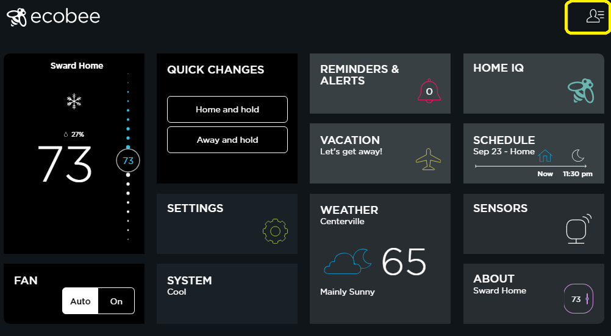
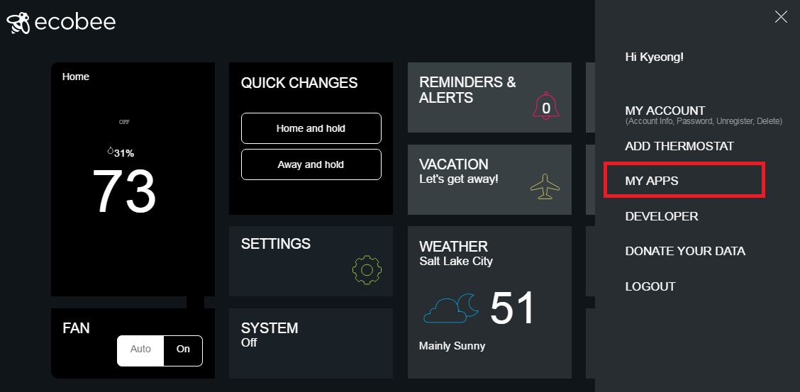
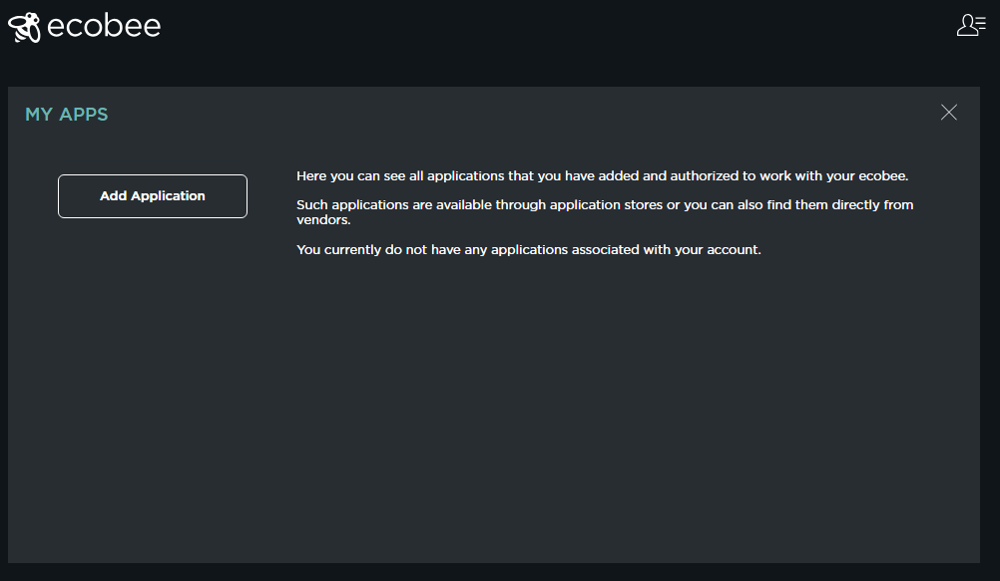
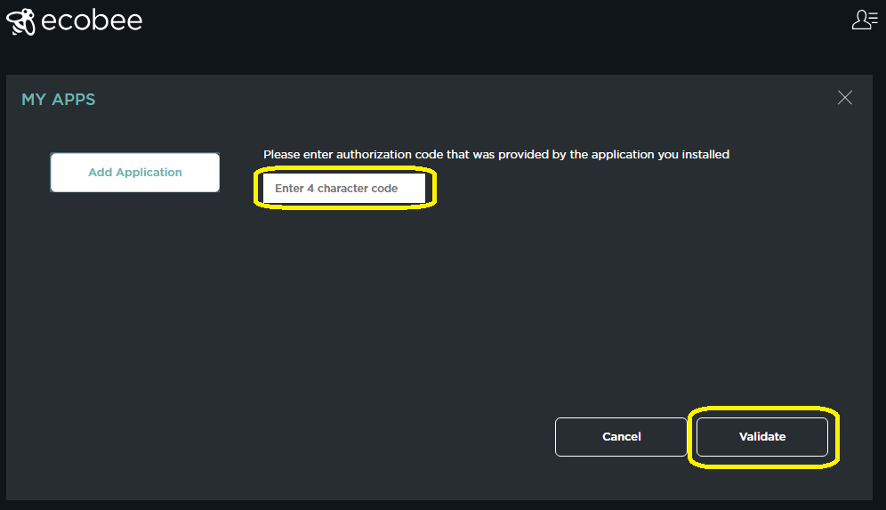
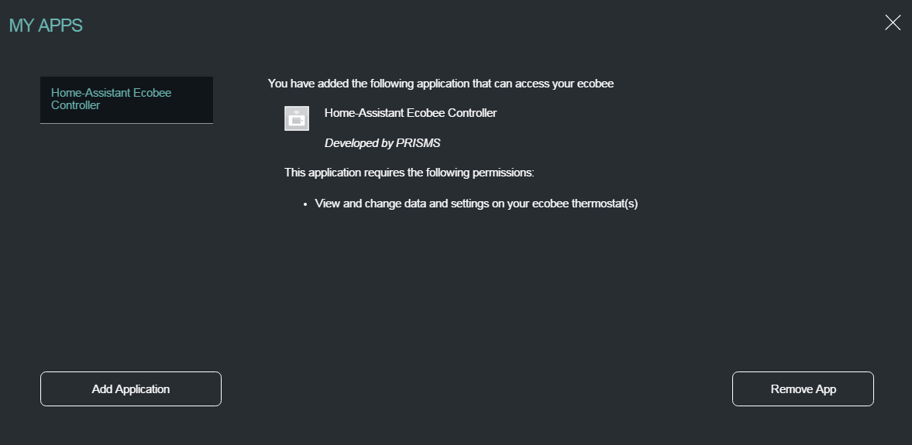

# Setup Ecobee Smart Thermostat Actuator

## Introduction

Ecobee Smart Thermostat is used as an actuator in SmartAir to control the furnace fan at home. SmartAir can issue commands to the thermostat through the cloud server application programming interfaces (API) and turn on/off the furnace fan. When the furnace fan turns on, it pulls in air through the filtering system and clean out dust and allergens.

Ecobee provides cloud server secure APIs for programmers's applications to interact with the Ecobee home thermostat programatically. 

To allow only permitted applications to access the smart thermostat at home, the first step is to register the application in My Apps. The registration is important so that no one can access the device without being registered by the home owner/user.

## Goals
1. Create SmartAir Ecobee Controller application in MyApps
2. Create SmartAir Ecobee Monitor application in MyApps

Before proceeding with the SmartAir configuration, the following prerequisites must be met.

## Prerequisites
- Purchase Ecobee 3 (We used Ecobee 3 for our experiments)
- Connect and install Ecobee 3 at home
- Test the Ecobee 3 if it can control the furnace fan properly
- Create a user account from the Ecobee website (https://www.ecobee.com)
- Log into the Ecobee website

## Ecobee Main Window
Below is an example main window once a user is logged in. 

## 1. Creating SmartAir Ecobee Controller application in My Apps

### 1.1 Expand the navigation menu
Expand the navigation menu on the right-top conner by clicking a person image with three lines. This will show the screen shown in the picture below.
Next, click My Apps to navigate to the next page where you can see Add Application at the bottom left corner.

### 1.2 Add application
Click "Add Applicatin" Button to create a new permitted application.

### 1.3 Enter authorization code
Enter the authorization code you retrieve from the TESS framework service. When the TESS service starts, it stores a new authorzation code into the TESS server and display the code on the SmartAir website. You will be given a short period of time to enter the code. Once the time goes over, the TESS service generates a new authorization code. Once the code is entered, Click Validate button. 

### 1.4 Enter application information
Once the validatation succeeds, the next windows ask for your application information. Enter the application name, developer information, and required permissions (e.g. View and change data). After all informaiton is successfully entered, you will get the following confirmation window.

## 2. Creating SmartAir Ecobee Monitor application in My Apps
Creating the monitor application is same as creating the Controller application except for the authorization code and the application  information. Each application should have its own unique authorization code. This new monitor authorization code can also be retrieved from the SmartAir dashboard website.

## 3. Finished
Check the SmartAir dashboard website to see if the SmartAir Ecobee Controller and Monitor applications operate and start showing UMDS sensor data on the displayed graphs and operation mode on the display dashboard.

If any application shows authorization problems, check the authorization code and try to enter the new authorzation code into the Ecobee website. 
